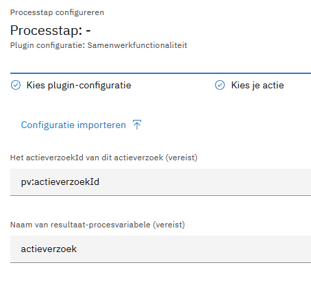
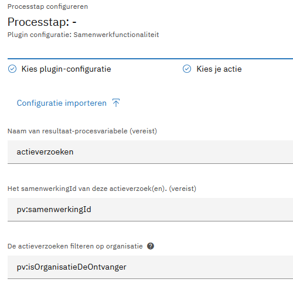

# Plugin Documentation

<!-- Use this page to document your plugin. Below is a suggested structure. -->

## Overview

This is a sample plugin demonstrating an API call action. It fetches data from a time API endpoint.

## Dependencies

### Backend

```kotlin
dependencies {
    implementation("com.ritense.valtimoplugins:samenwerkfunctionaliteit-plugin:1.0.0")
}
```

### Frontend

```json
{
  "dependencies": {
    "@valtimo-plugins/samenwerkfunctionaliteit-plugin": "1.0.0"
  }
}
```

In your `app.module.ts`:

```typescript
import {
    SamenwerkfunctionaliteitPluginModule, samenwerkfunctionaliteitPluginSpecification,
} from '@valtimo-plugins/samenwerkfunctionaliteit';

@NgModule({
    imports: [
        SamenwerkfunctionaliteitPluginModule,
    ],
    providers: [
        {
            provide: PLUGIN_TOKEN,
            useValue: [
                samenwerkfunctionaliteitPluginSpecification,
            ]
        }
    ]
})
```

## Configuration

List the plugin configuration properties and how to set them.

| Property | Type | Required | Description |
|----------|------|----------|-------------|
|          |      |          |             |

## Actions

### Time API test action

Sends a GET request to the configured API URL and returns the timezone response.

| Parameter | Type | Required | Description |
|-----------|------|----------|-------------|
|           |      |          |             |

### GET getActieverzoek

Sends a GET request to retrieve a single **actieverzoek** (action request).
**Usage:** Add this plugin action to an **operaton service task** in your process. The result of this request must be
stored in an **operaton process variable**, for example **"actieverzoek"**.

| Parameter      | Type | Required | Description                                                                         |
|----------------|------|----------|-------------------------------------------------------------------------------------|
| resultPvName   | Text | Yes      | The name of the process variable you'd like to store the requested actieverzoek in. |
| actieverzoekId | Text | Yes      | The id of the requested actieverzoek.                                               |

Voorbeeld `*.processlink.json`:

```json
{
  "activityId": "Activity_00fynp6",
  "activityType": "bpmn:ServiceTask:start",
  "pluginConfigurationId": "12023724-a4bd-431d-93c0-5ba52049e9cd",
  "pluginActionDefinitionKey": "get-actieverzoek",
  "actionProperties": {
    "resultPvName": "actieverzoek",
    "actieverzoekId": "pv:actieverzoekId"
  },
  "processLinkType": "plugin"
}
```


---

### GET getAlleActieverzoeken

Sends a GET request to retrieve all **actieverzoeken** (action requests) of a **samenwerking**.
**Usage:** Add this plugin action to an **operaton service task** in your process. The result of this request must be
stored in an **operaton process variable**, for example **"actieverzoeken"**.

| Parameter                | Type | Required | Description                                                                                                                    |
|--------------------------|------|----------|--------------------------------------------------------------------------------------------------------------------------------|
| resultPvName             | Text | Yes      | The name of the process variable you'd like to store the requested actieverzoeken in.                                          |
| samenwerkingId           | Text | Yes      | The id of the samenwerking of which all actieverzoeken will be requested.                                                      |
| isOrganisatieDeOntvanger | Text | No       | If the requested actieverzoeken should be filtered for the requesting organisatie. An optional boolean which defaults to true. |

Voorbeeld `*.processlink.json`:

```json
{
  "activityId": "Activity_GetAlleActieverzoeken",
  "activityType": "bpmn:ServiceTask:start",
  "pluginConfigurationId": "12023724-a4bd-431d-93c0-5ba52049e9cd",
  "pluginActionDefinitionKey": "get-all-actieverzoeken",
  "actionProperties": {
    "resultPvName": "actieverzoek",
    "samenwerkingId": "pv:samenwerkingId",
    "isOrganisatieDeOntvanger": "pv:isOrganisatieDeOntvanger"
  },
  "processLinkType": "plugin"
}
```

---

## Usage

### How to Use the Plugin in a Process

Explain how to use the plugin in a process, with examples if applicable.

1. **Configure the Plugin**
   Set the `baseUrl` property in the plugin configuration to the base URL of your API.

2. **Add Actions to Operation Service Tasks**
    - For retrieving a single **actieverzoek**, use the **GET getActieverzoek** action in an operation service task.
    - For retrieving all **actieverzoeken**, use the **GET getAlleActieverzoeken** action in an operation service task.
    - Set the **isOrganisatieDeOntvanger** variable to true or false, depending on whether you would like to receive all actieverzoeken based on if your organisation is the receiver. This variable defaults to true. 

3. **Store the Results**
    - The result of **GET getActieverzoek** must be stored in an operation process variable named **"actieverzoek"**.
    - The result of **GET getAlleActieverzoeken** must be stored in an operation process variable named **"
      actieverzoeken"**.

4. **Example Process Flow**
    - Start the process.
    - Add an **operation service task** and select the **GET getActieverzoek** or **GET getAlleActieverzoeken** action.
    - Map the result to the respective operation process variable (**actieverzoek** or **actieverzoeken**).
    - Proceed with the rest of the process logic using the stored data.

